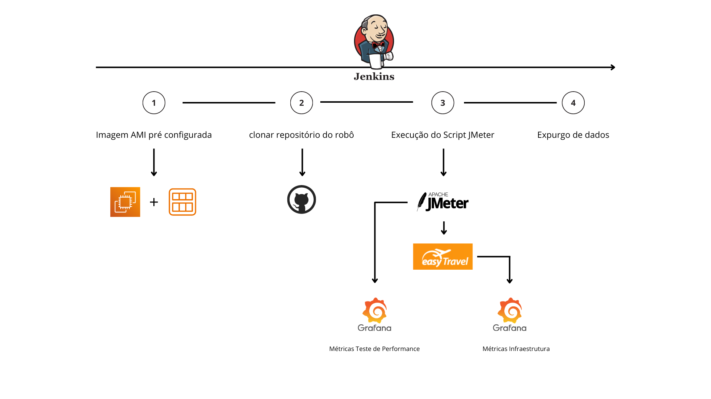

# Jenkins_Jmeter 

--- 
<td align="center">
    
</td>

---

O Jenkins_Meter é um projeto criado como parte do meu Plano de Desenvolvimento Individual (PDI), com o objetivo de aprimorar habilidades em DevOps e Testes Não Funcionais. Este projeto consiste em um laboratório de pipeline Jenkins para a execução de testes utilizando o JMeter.

Alem disso, desenvolvi um script em Terraform para provisionar a infraestrutura do projeto na nuvem.

---
## Tecnologias 

- Jenkins
- AWS
- Terraform
- ShellScript
- JMeter
- Python

## Arquitetura 

### Fluxo de execução jenkins: 

<td align="center">
    
</td>

### Arquitetura AWS: 

<td align="center">
    
</td>

## Licença
Este repositório é distribuído sob a licença MIT. Consulte o arquivo LICENSE para obter mais informações.

## Contato
Se você tiver alguma dúvida, sugestão ou feedback, sinta-se à vontade para entrar em contato através das issues do GitHub ou enviando um e-mail para:

joaovlima.delima@gmail.com